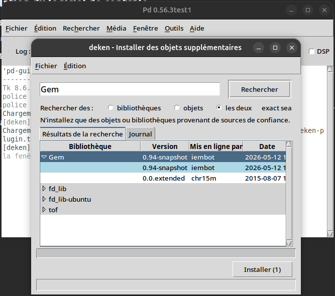
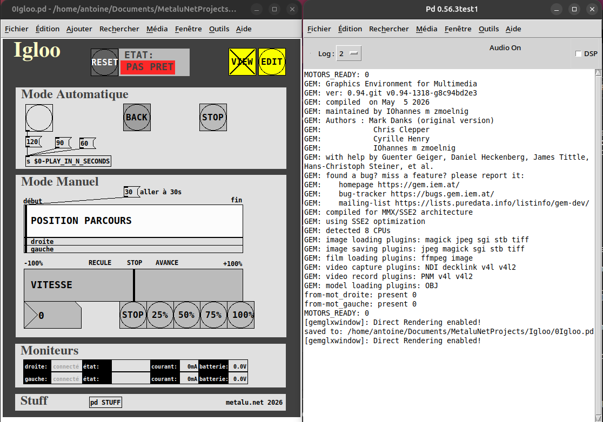
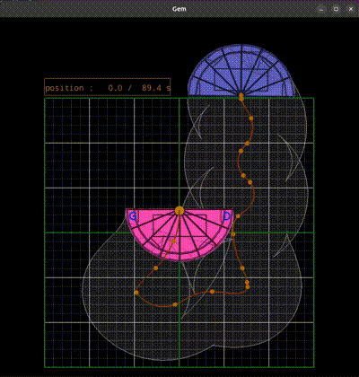
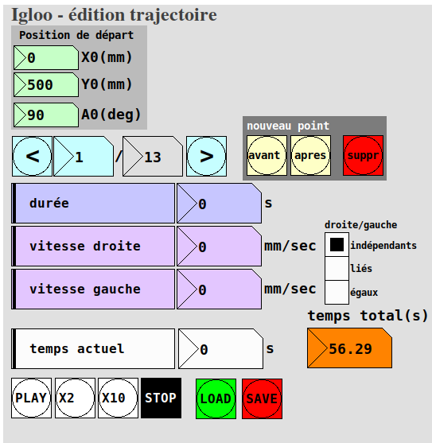

# Igloo

Automatisation d'une structure mobile pour le spectacle PIED de [La Ruse](https://www.laruse.org).

----------

## Installation du logiciel de contrôle

- ### Installer PureData 
voir ici: [https://puredata.info/downloads/pure-data](https://puredata.info/downloads/pure-data)

- ### Installer la bibliothèque graphique *GEM* pour PureData :

    - lancer PureData (Pd)
    - ouvrir le menu *Outils/Installer des objets supplémentaires* (ou *Tools/Find externals*)
    - chercher "Gem"
    - installer la bibliothèque **Gem**

- ### Installer le logiciel Igloo  
    - télécharger l'archive du projet: [https://github.com/MetaluNetProjects/Igloo/archive/refs/heads/main.zip](https://github.com/MetaluNetProjects/Igloo/archive/refs/heads/main.zip)
    - la décompresser (l'extraire) quelque part ; on appellera ce dossier `Igloo/` dans la suite de l'explication (le nom par défaut du dossier est `Igloo-main/` mais on peut le renommer si on veut)

## Utilisation du logiciel de contrôle
Ouvrir le *patch* `Igloo/0Igloo.pd` avec Pd (un document Pd s'appelle un *patch*):

Dans la *console* de Pd (la fenêtre de texte à droite sur la capture d'écran, nommée Pd0.56xxx), vérifier que la bibliothèque Gem est bien chargée. Cette bibliothèque permet de visualiser la trajectoire de l'igloo. Elle n'est pas absolument nécessaire pour lancer un parcours déjà écrit sur la machine.

La fenêtre principale comporte plusieurs parties :

- ### Le RESET
    Ce bouton permet d'initialiser la position de l'igloo et d'envoyer le programme de la trajectoire aux moteurs.  

    L'igloo doit être correctement positionné à sa place de départ, avant de confirmer le RESET. A la suite du RESET, l'indicateur **ETAT** doit afficher **PRET** ; dans le cas contraire, cela signifie que l'un des deux moteurs n'est pas connecté ou présente un problème (se reporter aux *Moniteurs* pour avoir des indications sur le problème).

- ### VIEW /EDIT
    Le bouton **VIEW** permet d'afficher la trajectoire dans une fenêtre graphique. **Ne pas manipuler ce bouton pendant le déplacement réel de l'igloo** (l'ouverture de la fenêtre graphique déclenche l'arrêt des moteurs).

Le bouton **EDIT** ouvre la fenêtre d'édition de la trajectoire (cf chapitre *Édition de la trajectoire*).

- ### Mode Automatique
    Ce mode permet de lancer la trajectoire en mode automatique, en spécifiant le temps de parcours voulu en secondes.  
    Ce mode garanti la synchronisation des 2 moteurs, même si la liaison wifi n'est pas très bonne.  
    Le bouton **PLAY**, dont le nom ne s'affiche que quand l'**ETAT** est **PRET**, est relié sur le *message* `[120(` qui va demander une lecture de la trajectoire en 120 secondes. Il est aussi possible de cliquer directement sur le *message* `[120(` ou sur les autres *messages*, comme `[90(`. Il est aussi possible de changer la valeur des messages ou d'en ajouter d'autres :  
    - passer en mode *Edition* via le menu *Edition/Mode édition* ou `Ctrl+E`  
    - cliquer dans un *message* et éditer sa valeur
    - ou ajouter un nouveau *message* (menu *Ajouter/Message*) avec la valeur désirée, et le connecte sur la case `[s $0-PLAY_IN_N_SECONDS]` (tirer le "fil" en partant du message créé)
    - sauver le *patch* (*Fichier/Enregistrer* ou `Ctrl+S`)
    - sortir du mode *Edition* (`Ctrl+E`)
    
    Remarque : le temps minimum du parcours (correspondant à la vitesse 100%) est celui indiqué dans la fenêtre *Édition de la trajectoire* : on ne peut pas aller plus vite que la trajectoire programmée, mais on peut aller plus lentement.

    Le bouton **BACK** permet de revenir à l'emplacement de départ après que la trajectoire aie été jouée, ou après l'appui sur **STOP**.

- ### Mode Manuel
    Ce mode permet de se déplacer librement sur le parcours, soit via une commande directe de position, soit via une commande de vitesse.  

    Ce mode nécessite une bonne liaison wifi avec les moteurs ; dans le cas contraire, de légères erreurs de trajectoires sont possibles.

- ### Moniteurs
    Ce sont des indicateurs sur l'état des deux moteurs, "droite" et "gauche".  

    L'indicateur le plus important est "*connecté*", qui doit s'allumer en vert quand la connexion est établie.  

    Un autre indicateur important est l'état de la charge de la batterie, qui doit toujours être supérieure à 11.5V, idéalement au dessus de 12.5V. Il est important de recharger les batteries le plus souvent possible, et surtout de ne **jamais laisser des batteries se décharger** pendant le stockage. C'est leur "mort" assurée.  

    L'indicateur de courant donne une idée de la force qu'exerce un moteur. Une valeur anormalement élevée (à définir d'après les essais) peut signifier que quelque chose "coince" mécaniquement quelque part.

- ### Stuff
    Ici on peut accéder aux parties internes de programme.  
    Par exemple :  
    - "visu" concerne l'affichage graphique de la trajectoire, voire le chapitre **Édition de la trajectoire**.  
    - "pd CONFIG" contient le paramétrage de la machine et les coordonnées de la position initiale de l'igloo.  
    - "driver" concerne l'interfaçage avec les moteurs.

## Édition de la trajectoire

Cette fenêtre permet d'éditer la trajectoire courante, de la faire jouer visuellement, et également d'effectuer des sauvegardes et de les recharger.

La trajectoire est définie comme une suite de points, pour lesquels on spécifie la vitesse de chacun des moteurs et la durée du segment.

La position de départ est fixée ; on peut la changer dans stuff/CONFIG, en éditant la valeur du message connecté à l'objet `[s $0-INIT_XY]`, mais cela aura pour effet de décaler toutes les trajectoires déja enregistrées.

Le bouton **new** permet de créer un nouveau point juste avant le point actuel, le bouton **delete** de supprimer le point actuel.

Les boutons **PLAY**, **X2** (deux fois plus vite), **X10** ou **STOP** (dix fois plus vite) permettent de lancer ou arrêter l'animation sur la fenêtre graphique, mais n'envoient pas d'instruction aux moteurs. De même le slider **temps actuel** permet de déplacer manuellement la représentation de l'igloo tout au long du parcours.

## Fichiers de trajectoire

Le programme fonctionne avec un fichier de trajectoire "courant", qui est sauvegardé automatiquement après chaque modification. Pas besoin donc de "sauver(**SAVE**)" ou "charger(**LOAD**)" pendant la session de travail.

Par contre, à la fin de la session, il sera indispensable de sauver la trajectoire en choisissant un nom de fichier signifiant (genre avec la date courante), de manière à pouvoir le transmettre (par exemple par mail) à l'autre régisseur.

Les fichiers trajectoires sont stockés dans `Igloo/sequences`.

Donc à l'issue de la résidence :

- le régisseur 1 sauve la trajectoire (**SAVE**), avec comme nom par exemple `final_26juin2026`
- il envoie par mail le fichier `Igloo/sequences/final_26juin2026` au régisseur 2 (et à tout le monde par sécurité ;-)
- le régisseur 2 télécharge le fichier, le place dans son ordi dans `Igloo/sequences`, et charge ce fichier (**LOAD**) dans le logiciel.

----------
GNU GENERAL PUBLIC LICENSE - metalu.net 2026