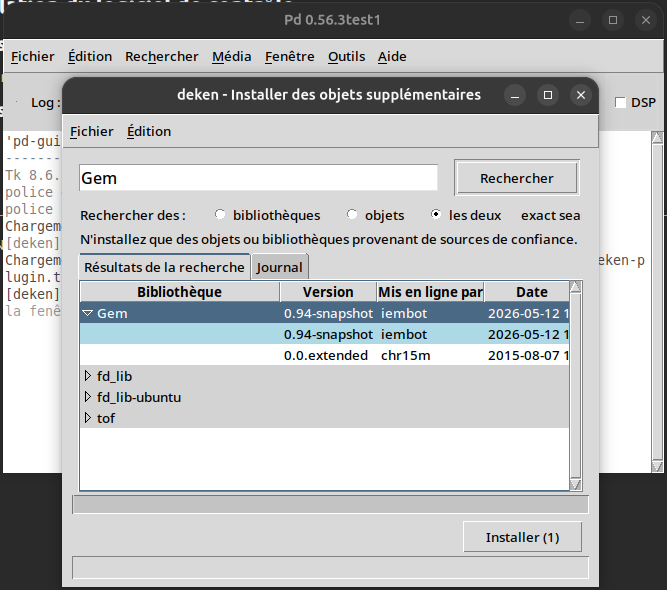
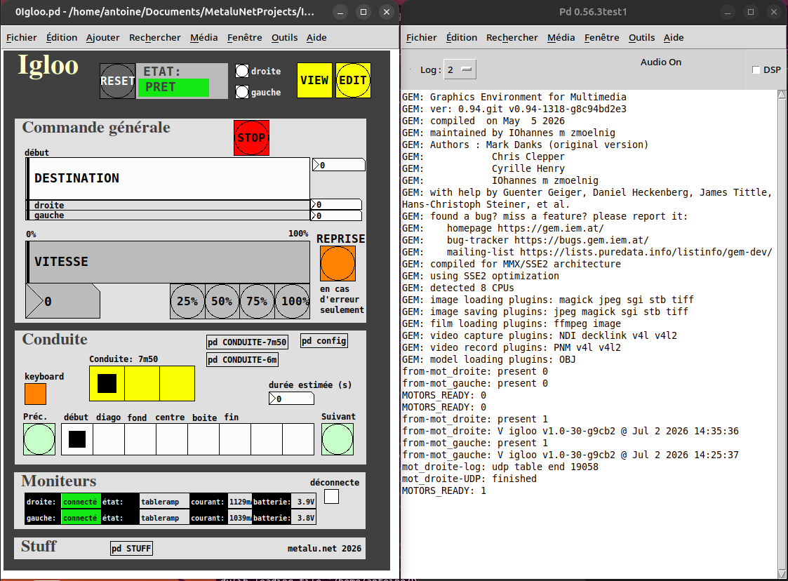
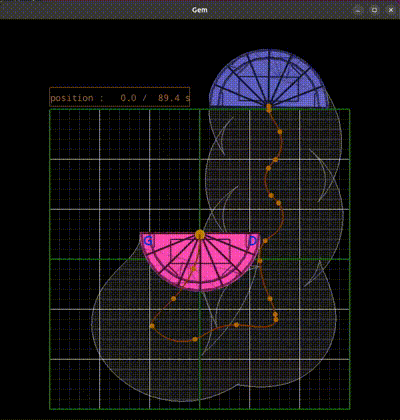
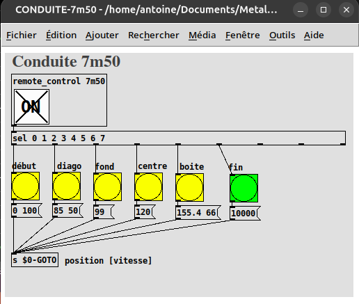
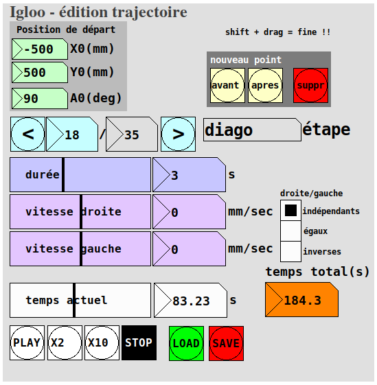

# Igloo

Automatisation d'une structure mobile pour le spectacle PIED de [La Ruse](https://www.laruse.org).

----------

## Installation du logiciel de contrôle

- ### Installer PureData 
voir ici: [https://puredata.info/downloads/pure-data](https://puredata.info/downloads/pure-data)

- ### Installer la bibliothèque graphique *GEM* pour PureData :

    - lancer PureData (Pd)
    - ouvrir le menu *Outils/Installer des objets supplémentaires* (ou *Tools/Find externals*)
    - chercher "Gem"
    - installer la bibliothèque **Gem**

- ### Installer le logiciel Igloo  
    - télécharger l'archive du projet: [https://github.com/MetaluNetProjects/Igloo/archive/refs/heads/main.zip](https://github.com/MetaluNetProjects/Igloo/archive/refs/heads/main.zip)
    - la décompresser (l'extraire) quelque part ; on appellera ce dossier `Igloo/` dans la suite de l'explication (le nom par défaut du dossier est `Igloo-main/` mais on peut le renommer si on veut)

## Utilisation du logiciel de contrôle
Ouvrir le *patch* `Igloo/0Igloo.pd` avec Pd (un document Pd s'appelle un *patch*):

Dans la *console* de Pd (la fenêtre de texte à droite sur la capture d'écran, nommée Pd0.56xxx), vérifier que la bibliothèque Gem est bien chargée. Cette bibliothèque permet de visualiser la trajectoire de l'igloo. Elle n'est pas absolument nécessaire pour lancer un parcours déjà écrit sur la machine.

La fenêtre principale comporte plusieurs parties :

- ### Le RESET
    Ce bouton permet d'initialiser la position de l'igloo et, si besoin, d'envoyer le programme de la trajectoire aux moteurs.  
    Les boutons "droite" et "gauche" permettent de renvoyer la séquence à l'un des moteurs, si la tentative précédente a échoué.

    L'igloo doit être correctement positionné à sa place de départ, avant de confirmer le RESET. A la suite du RESET, l'indicateur **ETAT** doit afficher **PRET** ; dans le cas contraire, cela signifie que l'un des deux moteurs n'est pas connecté ou présente un problème (se reporter aux *Moniteurs* pour avoir des indications sur le problème).

- ### VIEW /EDIT
    Le bouton **VIEW** permet d'afficher la trajectoire dans une fenêtre graphique :

    

    Le bouton **EDIT** ouvre la fenêtre d'édition de la trajectoire (cf chapitre *Édition de la trajectoire*).

- ### Commande générale

    Le slider **DESTINATION** permet de commander la destination des moteurs, le long de la trajectoire programmée. La valeur correspond au temps de la séquence originale (dans la fenêtre d'Édition).

    Le slider **VITESSE** permet de commander la vitesse globale du déplacement, de 0 à 100% de la vitesse de la séquence originale.

    Le bouton **REPRISE** permet de tenter de récupérer la lecture, après qu'une erreur ait été détectée et ait nécessité l'arrêt d'urgence ; en général, l'erreur est une surcharge de puissance, vraisemblablement causée par un obstacle sur le parcours.  
Il peut arriver qu'il faille appuyer plusieurs fois avant que le voyant **PRET** repasse au vert ; dans ce cas, attendre quelques secondes avant de rappuyer sur **REPRISE**.  
Il peut aussi arriver que les moteurs ne puissent pas récupérer la situation... dans ce cas un RESET est nécessaire.

- ### Conduite

    Ce panneau permet de déclencher le déplacement vers un point d'**étape** (début, diago, fond etc.), dans un temps donné en secondes.  
    Plusieurs "conduites" peuvent être définies, par exemple "7m50" et "6m"; le fichier trajectoire du même nom (ex: "7m50") est automatiquement chargé lorsqu'on choisit une "conduite".  
    Les **étapes** sont définies lors de l'édition de la trajectoire.

    

- ### Moniteurs
    Ce sont des indicateurs sur l'état des deux moteurs, "droite" et "gauche".  

    L'indicateur le plus important est "*connecté*", qui doit s'allumer en vert quand la connexion est établie.  

    Un autre indicateur important est l'état de la charge de la batterie, qui doit toujours être supérieure à 11.5V, idéalement autour de 12.5V. Il est important de recharger les batteries le plus souvent possible, et surtout de ne **jamais laisser des batteries se décharger** pendant le stockage. C'est leur "mort" assurée.  

    L'indicateur de courant donne une idée de la force qu'exerce un moteur. Une valeur anormalement élevée (à définir d'après les essais) peut signifier que quelque chose "coince" mécaniquement quelque part.

- ### Stuff
    Ici on peut accéder aux parties internes de programme.  
    Par exemple :  
    - "visu" concerne l'affichage graphique de la trajectoire, voire le chapitre **Édition de la trajectoire**.  
    - "pd CONFIG" contient le paramétrage de la machine et les coordonnées de la position initiale de l'igloo.  
    - "driver" concerne l'interfaçage avec les moteurs.

## Édition de la trajectoire

Cette fenêtre permet d'éditer la trajectoire courante, de la faire jouer visuellement, et également d'effectuer des sauvegardes et de les recharger.

La trajectoire est définie par une position de départ et une suite de points, pour lesquels on spécifie la vitesse de chacun des moteurs et la durée du segment.

Les boutons **nouveau point** permet de créer un nouveau point **avant** ou **après** le point actuel, le bouton **suppr** de supprimer le point actuel.

Les boutons **PLAY**, **X2** (deux fois plus vite), **X10** ou **STOP** (dix fois plus vite) permettent de lancer ou arrêter l'animation sur la fenêtre graphique, mais n'envoient pas d'instruction aux moteurs. De même le slider **temps actuel** permet de déplacer manuellement la représentation de l'igloo tout au long du parcours.

À un point donné peut être associé le nom d'une **étape** ("diago", "fond" etc.). Attention à ne pas utiliser le même nom pour plusieurs points.  
Les étapes "start" et "end" sont automatiquement ajoutées (non visibles dans la fenêtre Édition).

## Fichiers de trajectoire

Le programme fonctionne avec un fichier de trajectoire "courant", qui est sauvegardé automatiquement après chaque modification. Pas besoin donc de "sauver(**SAVE**)" ou "charger(**LOAD**)" pendant la session de travail.

Par contre, à la fin de la session, il sera indispensable de sauver la trajectoire en choisissant un nom de fichier signifiant (genre avec la date courante), de manière à pouvoir le transmettre (par exemple par mail) à l'autre régisseur.

Les fichiers trajectoires sont stockés dans `Igloo/sequences`.

Donc à l'issue de la résidence :

- le régisseur 1 sauve la trajectoire (**SAVE**), avec comme nom par exemple `final_26juin2026`
- il envoie par mail le fichier `Igloo/sequences/final_26juin2026` au régisseur 2 (et à tout le monde par sécurité ;-)
- le régisseur 2 télécharge le fichier, le place dans son ordi dans `Igloo/sequences`, et charge ce fichier (**LOAD**) dans le logiciel.

----------
GNU GENERAL PUBLIC LICENSE - metalu.net 2026